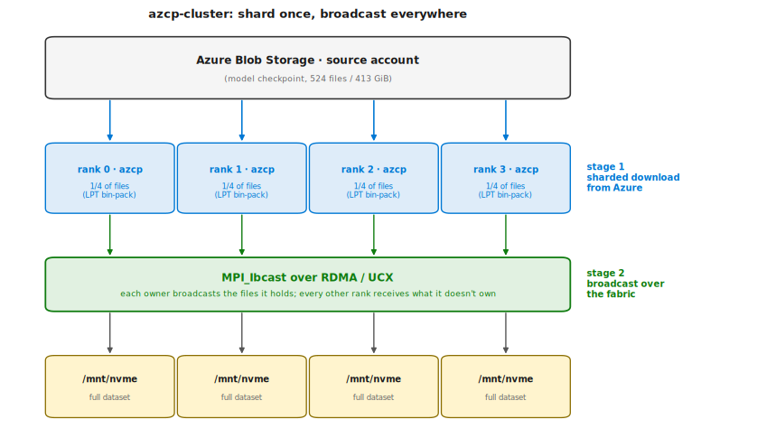

# Distributing model weights to your AI cluster: a faster pre-flight on AKS and Slurm

*Originally published 7 May 2026 on the [Azure High Performance Computing
Blog](https://techcommunity.microsoft.com/blog/azurehighperformancecomputingblog/distributing-model-weights-to-your-ai-cluster-a-faster-pre-flight-on-aks-and-slu/4517294).*

*Standing up an N-node training or inference job and waiting forever for
the model checkpoint to land on every node's NVMe? Here's a small Rust + 
MPI tool — `azcp-cluster` — that pays Azure egress once, broadcasts
over your fabric, and finishes in seconds. Plus the AKS and Slurm
patterns to wire it into a real pipeline.*

---

## Why this exists

You've provisioned a multi-node GPU cluster on Azure. NDR InfiniBand.
The training script is ready. Before any GPU does any useful work, every
node needs the **same 400 GB model checkpoint** on its local NVMe.

The naive approach — `azcopy` (or our Rust equivalent, `azcp`) on every
node, in parallel — has three problems:

1. **You pay Azure egress N times.** Same bytes, same source account, N
   separate downloads. Microsoft's published
   [scalability target for a standard storage account](https://learn.microsoft.com/en-us/azure/storage/common/scalability-targets-standard-account)
   is 200 Gbps egress (region-dependent). It's a target, not a hard
   cap — our sharded download peaked at 236 Gb/s on a 16-node run —
   but if every node is hammering the same account independently you
   start seeing `503 ServerBusy` well before the cluster fills up.
2. **It's slower than your fabric should allow.** Per-node Azure
   throughput tops out around 19-25 Gb/s on a default AKS pod (overlay
   network, single connection pool). Meanwhile the InfiniBand fabric
   between those same nodes is sitting idle at **400 Gb/s NDR**.
3. **Your job blocks on the slowest node.** Distributed training won't
   start until rank 0 says "everyone has the data." With per-node
   downloads, that's whichever node had the unluckiest TCP retry.

You're paying for a 400 Gb/s fabric and using a 25 Gb/s pipe.

## How `azcp-cluster` does it differently

The shape is obvious once you say it: **download `1/N` of the dataset
per rank from Azure, then `MPI_Ibcast` the rest over the fabric**. A
sharded download across N nodes — each byte leaves Azure exactly once,
instead of once per node — then fan out at fabric speed.

`azcp-cluster` is a small MPI binary that does exactly that:



Sharding uses **deterministic LPT bin-packing** — files sorted by size
descending, greedily assigned to the least-loaded rank — so rank load
spread is typically <2% even on lopsided file-size distributions
(measured 1.3% on the DeepSeek-R1 checkpoint). Bcast is **pipelined**
(non-blocking `MPI_Ibcast` with multiple chunks in flight per file,
sized via `--bcast-chunk` / `--bcast-pipeline`) and writes are
**asynchronous** (a dedicated writer thread per rank, decoupled from
the MPI receive loop) so NVMe write speed and fabric receive overlap.

**Measured on a 16-node Azure GB300 cluster**, NDR 400 Gb/s, 4× HCA per
node, 413 GiB / 524-file checkpoint to per-node NVMe (single example
run; reproducer script
[`tests/cluster_bench.sh`](https://github.com/edwardsp/azcp/blob/main/tests/cluster_bench.sh)):

| Stage | Throughput | Wall-clock |
|---|---:|---:|
| `[download]` (Azure → ranks, aggregate) | 236 Gb/s | 14 s |
| `[bcast]` (per receiver, RDMA/UCX) | **99.2 Gb/s** | 33 s |
| **`[total]` end-to-end** | — | **48 s** |

The two stages run sequentially (bcast starts after download
completes); the extra ~1 s in `[total]` is `[list]` + `[diff]` +
`[filelist]` overhead. Per-node `azcp` for comparison: ~3-5 minutes
wall-clock and **16× the egress bill** (the whole 413 GiB transferred
16 times instead of once). It's not just the bill — it's also 16× the
demand on the source storage account, which pushes you past the
200 Gbps target into `503 ServerBusy` territory and the retry storm
that comes with it. And that multiplier scales linearly with cluster
size: at 64 nodes it's 64×, at 256 nodes it's 256×, while the
broadcast version still pays Azure egress exactly once regardless of
N.

Two things had to be true to get there: receivers parallelised the
NVMe write path with **multiple writer threads** (default 2, flag
`--bcast-writers`), and they opened destination files with
**`O_DIRECT`** (default on, opt-out via `--no-bcast-direct`). With a
single buffered writer the path collapses to ~28 Gb/s — page-cache
contention, not the fabric, becomes the ceiling. Bypassing the page
cache with O_DIRECT and parallelising across two writers per rank
lifts that to 99 Gb/s; bumping to tmpfs (no disk in the path at all)
shows the fabric ceiling is ~140 Gb/s on this hardware. Full sweep
including a `--verify` end-to-end MD5 check is in
[`docs/cluster-benchmarks.md`](https://github.com/edwardsp/azcp/blob/main/docs/cluster-benchmarks.md).

## After the download: the handoff

`azcp-cluster` finishes and every node has the full dataset on local
NVMe. **Now your training/inference job needs to start, on those same
nodes, and read from those same disks.** This is where the platform
story diverges.

On **Slurm**, this is one sbatch with two `srun` steps. Done.

On **AKS**, you have to think about three things — storage backend,
sequencing, and quota — and none of them have a single obvious answer
yet. Both are below.

---

## Practical: Slurm

Slurm makes this easy because the whole pipeline runs inside **one
sbatch allocation**: nodes don't move between stages, per-node
`/mnt/nvme` persists, and `srun` is a stage sequencer for free.

The full example is at
[`examples/slurm/download-then-train.sbatch`](https://github.com/edwardsp/azcp/blob/main/examples/slurm/download-then-train.sbatch).
The shape:

```bash
#SBATCH --nodes=4
#SBATCH --gres=gpu:8
#SBATCH --time=04:00:00

srun --ntasks-per-node=1 mkdir -p /mnt/nvme/dataset

# Stage 1: download + bcast (azcp-cluster image)
srun --mpi=pmix \
     --container-image=/shared/images/azcp-cluster.sqsh \
     --container-mounts=/dev/infiniband:/dev/infiniband,/mnt/nvme:/mnt/nvme \
     azcp-cluster "$SOURCE_URL" /mnt/nvme/dataset \
       --bcast-chunk 512M --bcast-pipeline 16 --compare size

# Stage 2: training (different image, same allocation, same nodes)
srun --container-image=/shared/images/training.sqsh \
     --container-mounts=/mnt/nvme:/mnt/nvme \
     torchrun --nnodes=$SLURM_NNODES --nproc-per-node=8 \
              train.py --model-path /mnt/nvme/dataset
```

The snippet above is trimmed for readability. The full launcher
([`examples/slurm/download-then-train.sbatch`](https://github.com/edwardsp/azcp/blob/main/examples/slurm/download-then-train.sbatch))
adds the UCX environment (`UCX_TLS`, `UCX_NET_DEVICES`,
`UCX_IB_GID_INDEX`), `--container-writable`,
`--no-container-entrypoint`, and the per-rank `torchrun` glue —
drop those and you'll either fail to launch or silently fall back to
TCP.

Two different containers, two different stages, one allocation. Slurm
holds the node reservation across both `srun` calls, so the per-node
NVMe state written by stage 1 is naturally available to stage 2 — no
sentinel files, no priority classes, no operator coordination needed.

For sites without pyxis, swap `--container-image=` for
`apptainer exec`; see
[`examples/slurm/apptainer.sbatch`](https://github.com/edwardsp/azcp/blob/main/examples/slurm/apptainer.sbatch).

## Practical: AKS

Kubernetes has no Slurm-allocation analog out of the box — pods come and
go, and the scheduler treats nodes as fungible resource buckets. So the
question is: how do you keep the training job on the same nodes the
download just populated?

The cleanest answer, by a wide margin, is to **not separate them in the
first place**: run both phases inside one MPIJob, with one merged worker
image that contains both `azcp-cluster` and your training stack. The
launcher script becomes two `mpirun` calls, one after the other. The
node allocation is held by the MPIJob across both phases — no
cross-workload sequencing, no node-pinning glue, no extra controllers.

### Adding azcp-cluster to your existing image

You almost certainly already have a curated training or inference image
— NGC PyTorch, NGC TensorFlow, vLLM, your team's fine-tuning image,
whatever. The merged image is just **your image plus four `COPY` lines
and one `apt install`**:

```dockerfile
FROM nvcr.io/nvidia/pytorch:24.10-py3   # or whatever you already use

ARG AZCP_VERSION=v0.3.0

COPY --from=ghcr.io/edwardsp/azcp/azcp-cluster:${AZCP_VERSION} \
     /opt/openmpi /opt/azcp/openmpi
COPY --from=ghcr.io/edwardsp/azcp/azcp-cluster:${AZCP_VERSION} \
     /opt/ucx /opt/azcp/ucx
COPY --from=ghcr.io/edwardsp/azcp/azcp-cluster:${AZCP_VERSION} \
     /usr/local/bin/azcp-cluster /usr/local/bin/
COPY --from=ghcr.io/edwardsp/azcp/azcp-cluster:${AZCP_VERSION} \
     /usr/local/bin/azcp /usr/local/bin/

RUN apt-get update && apt-get install -y openssh-server && rm -rf /var/lib/apt/lists/*
```

Three notes on what's in those lines:

- We copy `azcp-cluster`'s bundled Open MPI 4.1.6 + UCX 1.15.0 under
  `/opt/azcp/`, **not** the default `/opt/openmpi`. NGC images already
  ship HPC-X at `/opt/hpcx/`; vLLM and other inference images sometimes
  bring their own MPI too. Putting ours at a separate path means we
  don't clash, and your training stack continues using whatever MPI it
  was built against.
- The launcher script for stage 1 explicitly invokes
  `/opt/azcp/openmpi/bin/mpirun`, so phase 1 stays ABI-matched to the
  binary it was tested with.
- mpi-operator's launcher SSHes into worker pods to bootstrap MPI; most
  training images ship `openssh-client` but not `openssh-server`, hence
  the one apt install. Skip it if your base image already has sshd.

That's the whole "merged image" cost. A couple of hundred MB of files
copied (Open MPI + UCX + the two binaries), no Rust toolchain, no
source rebuild, no rebase of your training image.

### The two-phase launcher

The MPIJob launcher script runs both phases sequentially:

```bash
# Phase 1: download + broadcast
mpirun -np "$N" -hostfile /etc/mpi/hostfile \
  -mca pml ucx -x UCX_NET_DEVICES=mlx5_0:1,mlx5_1:1,mlx5_2:1,mlx5_3:1 \
  azcp-cluster "$SOURCE_URL" /mnt/nvme/dataset \
    --bcast-chunk 512M --bcast-pipeline 16 --compare size

# Phase 2: training (mpirun launches torchrun on each node — NCCL, not
# MPI, handles the actual training collectives)
MASTER_ADDR=$(head -1 /etc/mpi/hostfile | awk '{print $1}')
mpirun -np "$N" -hostfile /etc/mpi/hostfile \
  -x MASTER_ADDR="$MASTER_ADDR" -x MASTER_PORT=29500 \
  bash -c '
    torchrun \
      --nnodes='"$N"' --node_rank=$OMPI_COMM_WORLD_RANK \
      --nproc_per_node=8 \
      --master_addr=$MASTER_ADDR --master_port=$MASTER_PORT \
      /opt/train.py --model-path /mnt/nvme/dataset
  '
```

The `mpirun` lines are trimmed to the load-bearing arguments. The real
launcher in
[`examples/aks/mpijob-download-then-train.yaml`](https://github.com/edwardsp/azcp/blob/main/examples/aks/mpijob-download-then-train.yaml)
adds `--allow-run-as-root`, `--prefix /opt/azcp/openmpi`,
`-mca plm_rsh_agent ssh`, `-mca osc ucx`, `-mca routed direct`,
`-mca coll_hcoll_enable 0`, the full UCX environment
(`UCX_TLS=rc,sm,self`, `UCX_IB_GID_INDEX=3`, …) and the worker pod's
`IPC_LOCK` capability. Without those you either fail to launch or
silently fall back to TCP — copy the full manifest, don't retype the
snippet.

Phase 1 uses MPI for what MPI is good at — collective broadcast over
RDMA. Phase 2 uses `mpirun` purely as a process launcher to start
`torchrun` on every node with the right rank derived from
`$OMPI_COMM_WORLD_RANK`; the actual training collectives go through
NCCL, same as a plain `torchrun` Job. If your workload is genuinely
MPI-native (Megatron-MPI, Horovod, DeepSpeed-MPI), drop the `torchrun`
wrapper and `mpirun` your binary directly.

Authentication uses whatever `azcp` already supports (workload
identity on AKS, IMDS on plain VMs, az-cli token, SAS, shared key);
the MPIJob example wires up workload identity by setting
`AZURE_CLIENT_ID` to a user-assigned managed identity that has been
granted **Storage Blob Data Reader** on the source account. Adding
the identity and the role assignment is a one-time setup step (`az
identity create` + `az role assignment create`) and is the same work
you'd do for any other AKS workload that talks to blob storage.

Dockerfile:
[`examples/aks/Dockerfile.training`](https://github.com/edwardsp/azcp/blob/main/examples/aks/Dockerfile.training).
Storage is `hostPath` on the node's local NVMe — it persists naturally
across the two phases (and across re-runs, where
`azcp-cluster --compare size` skips already-present files for free).

### When this isn't the right pattern

The merged image works for distributed training, fine-tuning, eval,
batch inference, and anything else you'd normally launch with `torchrun`
or `mpirun`. It does not fit two cases:

- **Long-running serving** (vLLM, Ray, Deployment-shaped consumers).
  These load weights once and serve for hours or days; the per-node
  download cost is negligible amortized over the lifetime. Use a plain
  init container with `azcp` per pod and don't bother with broadcast.
- **The consumer must be a different CRD entirely**, owned by another
  team, not changeable. Then you really do need two separate workloads,
  and you have a scheduling problem.

### If you can't merge images

If the consumer genuinely can't share an image with `azcp-cluster`,
the Kubernetes scheduler is suddenly responsible for two non-trivial
things:

**Same-nodes pinning.** Kubernetes has no native "place this workload
on the same nodes another workload ran on" primitive. You either
dedicate a nodepool sized exactly to the job (so there's only one
valid placement and the pool sits idle between runs) or you label
nodes from the download pods, which needs cluster-level RBAC and
per-run cleanup.

**Gap-window starvation.** When the download workload completes, its
GPU and InfiniBand quota is released. On a busy multi-tenant cluster,
another tenant's workload can race in and grab those nodes before
your consumer is admitted — at which point the consumer queues
indefinitely waiting for nodes it can never get back. Workload-level
controllers like Kueue admit one workload at a time and don't reserve
quota for "the next workload from the same submitter."

**Reach for an initContainer first.** Both problems vanish if you
collapse the two workloads back into one Kubernetes object without
merging images. Run a plain Indexed `batch/v1.Job` where each pod has
an **initContainer** running `azcp-cluster` (broadcasting the dataset
to per-node NVMe over RDMA) and a **main container** running the
consumer against `/mnt/nvme`. Two different images, same pod,
init-then-main ordering enforced structurally by Kubernetes. No node
pinning needed (same pod ⇒ same node). No gap window (same pod ⇒
shared admission). No new CRDs. The cost is ~80 lines of bash to
hand-roll the MPI bootstrap inside the initContainer (sshd, hostfile,
mpirun) — see
[`examples/aks/init-container-download-then-train.yaml`](https://github.com/edwardsp/azcp/blob/main/examples/aks/init-container-download-then-train.yaml)
for a validated reference. This is the second-best AKS option after
the merged image, and it's the one to try before any of the heavier
options below.

**Heavier options if even that doesn't fit** (multi-stage pipelines,
long-running consumers, cross-team CRDs):

- **Argo Workflows** can capture the download MPIJob's worker node
  names as an output parameter and inject them into the consumer's
  `nodeAffinity`. Doesn't fully close the gap window — pair with
  Kueue priorities to minimize it.
- **Volcano** takes a different approach: a single Volcano Job CRD
  with internal task dependencies and gang scheduling, sequencing
  both stages in one admission unit. Cleanest model technically; not
  in the AKS managed-experience comfort zone.
- **JobSet + Kueue** wraps both stages in one JobSet (single Kueue
  admission) with manual node-pinning via shared nodepool exhaustion.
  Requires installing JobSet (alpha CRD) on top of Kueue and
  hand-rolling an MPI bootstrap (sshd, hostfile, mpirun) inside an
  indexed Job, since JobSet wraps `batch/v1 Jobs`, not `MPIJobs`.

Each of these adds at least one extension to the cluster and
substantially more YAML. For most distributed training and
fine-tuning, the merged-image pattern is strictly simpler — the
consumer image grows by four `COPY` lines and one `apt install`, and
the entire scheduling problem disappears.

---

## Try it

```bash
docker pull ghcr.io/edwardsp/azcp/azcp-cluster:v0.3.0
```

Multi-arch, `linux/amd64` and `linux/arm64`. Source and full docs at
[`github.com/edwardsp/azcp`](https://github.com/edwardsp/azcp).

| If you want to... | Start here |
|---|---|
| Run the standalone download on AKS (no downstream sequencing) | [`examples/aks/mpi-operator-job.yaml`](https://github.com/edwardsp/azcp/blob/main/examples/aks/mpi-operator-job.yaml) |
| Wire download + training together on AKS (merged image) | [`examples/aks/mpijob-download-then-train.yaml`](https://github.com/edwardsp/azcp/blob/main/examples/aks/mpijob-download-then-train.yaml) |
| Wire download + training together on AKS (separate images, no operator) | [`examples/aks/init-container-download-then-train.yaml`](https://github.com/edwardsp/azcp/blob/main/examples/aks/init-container-download-then-train.yaml) |
| Run the standalone download on Slurm | [`examples/slurm/azcp-cluster.sbatch`](https://github.com/edwardsp/azcp/blob/main/examples/slurm/azcp-cluster.sbatch) |
| Wire download + training together on Slurm | [`examples/slurm/download-then-train.sbatch`](https://github.com/edwardsp/azcp/blob/main/examples/slurm/download-then-train.sbatch) |
| Reproduce the benchmark on your own cluster | [`tests/cluster_bench.sh`](https://github.com/edwardsp/azcp/blob/main/tests/cluster_bench.sh) + [`docs/cluster-benchmarks.md`](https://github.com/edwardsp/azcp/blob/main/docs/cluster-benchmarks.md) |

## What's next

A few things still on the list:

- **Multi-rail UCX bcast.** The 99 Gb/s per-receiver number is the
  single-rail `MPI_Ibcast` ceiling; the GB300 nodes have 4 HCAs
  sitting there. Splitting the broadcast across rails (parallel
  `Ibcast`s on disjoint rail subsets, or a custom multi-tree
  implementation — not just a tuning flag) would push past the
  ~140 Gb/s tmpfs ceiling we see today.
- **Bcast tuning autodetect.** Chunk/pipeline defaults are
  conservative; on NDR fabrics the right answer is
  `--bcast-chunk 512M --bcast-pipeline 16`. Probing at startup would
  be more friendly than asking users to read the tuning doc.
- **A first-class AKS sequencing story.** Per the gap above.

Issues, PRs, and "hey we tried this and it broke on $cluster" reports
all welcome at [`github.com/edwardsp/azcp`](https://github.com/edwardsp/azcp).
